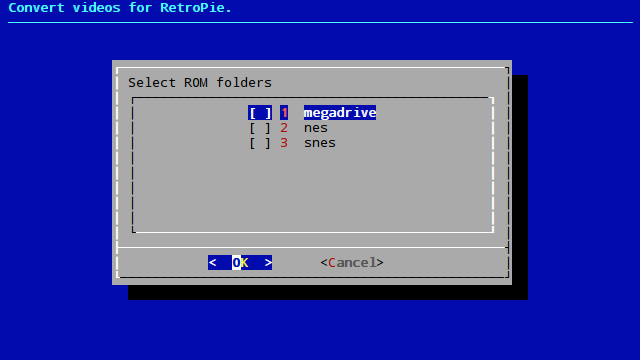

# RetroPie Convert Videos

A tool for RetroPie to convert videos.

**WARNING: The Raspberry Pi doesn't have that much power and converting videos is very demanding. It takes about 35 seconds to convert a video, so if you have a lot of videos... Do the math ;)**

## Prerequisites

At this moment this script only works with videos downloaded using:

* [Steven Selph's Scraper](https://github.com/retropie/retropie-setup/wiki/scraper#steven-selphs-scraper).
* [Lars Muldjord's Skyscraper](https://github.com/retropie/retropie-setup/wiki/scraper#lars-muldjords-skyscraper).

Use the **ROM folder for gamelists & images** option in Steven Selph's Scraper.

Use the **ROM folder for gamelists & media** option in Lars Muldjord's Skyscraper.

## Installation

```
cd /home/pi/
git clone https://github.com/hiulit/RetroPie-Convert-Videos.git
cd RetroPie-Convert-Videos/
sudo chmod +x retropie-convert-videos.sh
```

## Usage

```
./retropie-convert-videos.sh [OPTIONS]
```

If no options are passed, you will be prompted with a usage example:

```
USAGE: ./retropie-convert-videos.sh [OPTIONS]

Use './retropie-convert-videos.sh --help' to see all the options.
```

Before trying to convert any videos, `--to-ces` and `--scraper` must be set.

## Options

* `--help`: Print the help message and exit.
* `--from-ces [OPTIONS]`: Set Color Encoding System (C.E.S) to convert from. **(optional)**
* `--to-ces [OPTIONS]`: Set Color Encoding System (C.E.S) to convert to. **(mandatory)**
* `--scraper [OPTIONS]`: Set the scraper. **(mandatory)**
* `--convert-all`: Convert videos for all systems. **Warning! It can take a lot of time.**
* `--convert-systems [OPTIONS]`: Select systems to convert videos.

## Examples

### `--help`

Print the help message and exit.

#### Example

```
./retropie-convert-videos.sh --help
```

### `--from-ces [OPTIONS]` (optional)

Set Color Encoding System (C.E.S) to convert from in the [config file](/retropie-convert-videos-settings.cfg).

Target only videos with this particular C.E.S.
If left blank, it will target all videos, regardless of the C.E.S.

In most cases, you'd want to set it to `yuv444p` as this is the C.E.S that gives erros when using the OMX player.

#### Options

* `C.E.S` - Color Encoding System (C.E.S) to convert from.

#### Example

```
./retropie-convert-videos.sh --from-ces "yuv444p"
```

### `--to-ces [OPTIONS]` (mandatory)

Set Color Encoding System (C.E.S) to convert to in the [config file](/retropie-convert-videos-settings.cfg).

Convert videos to this particular C.E.S.

In most cases, you'd want to set it to `yuv420p` as this is the C.E.S that seems to work well with the OMX player.

#### Options

* `C.E.S` - Color Encoding System (C.E.S) to convert to.

#### Example

```
./retropie-convert-videos.sh --to-ces "yuv420p"
```

### `--scraper` (mandatory)

Set the scraper in the [config file](/retropie-convert-videos-settings.cfg).

#### Options

* `sselph`: Steven Selph's Scraper.
* `skyscraper`: Lars Muldjord's Skyscraper.

#### Example

```
./retropie-convert-videos.sh --scraper "sselph"
```

### `--convert-all`

**Warning! It can take a lot of time.**

Convert videos for all systems.

Checks the [config file](/retropie-convert-videos-settings.cfg) to see if at least the `to_ces` key has a value.

#### Example

```
./retropie-convert-videos.sh --convert-all
```

### `--convert-systems [OPTIONS]`

Select systems to convert videos.

If no options are passed, it displays a checklist from which one or more systems can be selected.

Checks the [config file](/retropie-convert-videos-settings.cfg) to see if at least the `to_ces` key has a value.

#### Options

* `systems` - Any of the system available in RetroPie's ROMS directory (e.g. `nes`, `snes`, `megadrive`, etc.). **Systems must be quoted**. See the example below.

#### Example (without options)

```
./retropie-convert-videos.sh --convert-systems
```



#### Example (with options)

```
./retropie-convert-videos.sh --convert-systems "nes snes"
```

## Config file

When setting the C.E.S using `--from-ces` or `--to-ces`, the generated values are stored in `retropie-convert-videos-settings.cfg`.

```
# Settings for RetroPie Convert Videos.
#
# TIP: run the 'avconv -pix_fmts' command to get a full list of Color Encoding Systems (C.E.S).

# From color (optional)
# Target only videos with this particular C.E.S.
# If left blank, it will target all videos, regardless of the C.E.S.
# (e.g. "yuv444p")

from_ces = ""

# To color (mandatory)
# Convert videos to this particular C.E.S.
# (e.g. "yuv420p")

to_ces = ""

# Scraper
# The scraper to be used.
# Available scrapers:
# - "sselph" (Steven Selph's Scraper).
# - "skyscraper" (Lars Muldjord's Skyscraper).

scraper = ""
```

You can edit this file directly instead of using `--from-ces`, `--to-ces` or `--scraper`.

## Changelog

See [CHANGELOG](/CHANGELOG.md).

## Contributing

See [CONTRIBUTING](/CONTRIBUTING.md).

## Authors

* Me 😛 [@hiulit](https://github.com/hiulit).

## Credits

Thanks to:

* [Clyde](https://retropie.org.uk/forum/user/clyde) - For [posting the code in the RetroPie forum](https://retropie.org.uk/forum/topic/15362/here-s-a-script-to-batch-convert-yuv-4-4-4-videos-to-yuv-4-2-0-in-retropie-linux) that inspired this script.
* [Dan Edwards](https://github.com/edwardsd97) - For helping with [#3](https://github.com/hiulit/RetroPie-Convert-Videos/pull/3).
* [furnace](https://retropie.org.uk/forum/user/furnace) and [mitu](https://retropie.org.uk/forum/user/mitu) - For pointing out some issues on how to better support [Lars Muldjord's Skyscraper](https://github.com/retropie/retropie-setup/wiki/scraper#lars-muldjords-skyscraper).

## License

[MIT License](/LICENSE).
